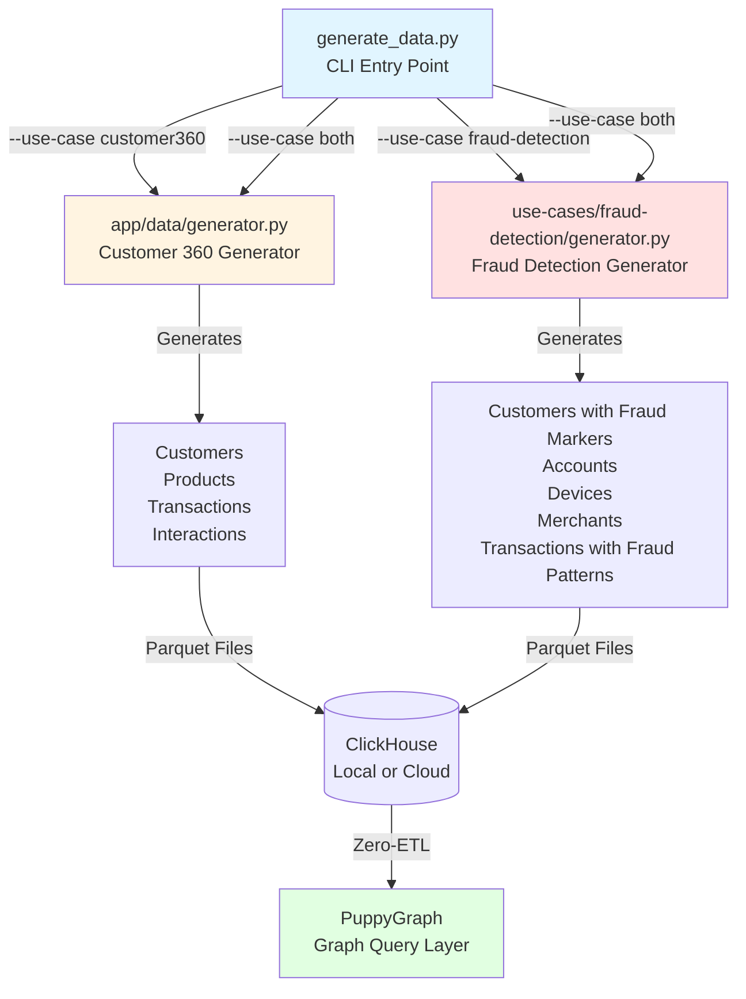

# PuppyGraph + ClickHouse Demo

Demo repository showcasing graph analytics on OLAP data using PuppyGraph and ClickHouse for two real-world use cases: Customer 360 and Fraud Detection.

## Overview

**The Challenge:** Traditional OLAP databases excel at analytical queries but struggle with relationship-based queries (friend networks, fraud rings, recommendation paths).

**The Solution:** PuppyGraph provides a zero-ETL graph query layer on top of ClickHouse, enabling both analytical SQL queries and graph traversals (Cypher/Gremlin) on the same data without duplication.

**Performance:** Graph queries that would take minutes with traditional JOIN-heavy SQL execute in milliseconds using PuppyGraph's native graph traversal.

## Table of Contents

- [Use Cases](#use-cases)
- [Documentation & Demo Guides](#documentation--demo-guides)
- [Data Generation Architecture](#data-generation-architecture)
- [Quick Start](#quick-start)
- [Dataset & Query Results](#dataset--query-results)
- [Configuration](#configuration-files)
- [Repository Structure](#repository-structure)

## Use Cases

### 1. Customer 360
Unified view of customer behavior combining transactional data with relationship graphs:
- Product affinity networks
- Customer segmentation analysis
- Cross-sell recommendation paths
- Behavioral pattern detection

**Scale**: 35.4M records (1M customers, 7.3M transactions, 27M interactions)

### 2. Fraud Detection
Real-time fraud detection using graph pattern matching:
- Fraud ring identification (5 embedded fraud scenarios)
- Suspicious transaction networks
- Shared attribute analysis (email, phone, device, address)
- Anomaly detection in relationships

**Scale**: 1.29M records (100K customers, 1M transactions, 1,950 fraud accounts)

## Documentation & Demo Guides

### Complete Walkthroughs

These guides provide rich, narrative-driven demonstrations with business context, expected results, and detailed explanations of what, where, when, how, and why for each query.

#### Customer 360 Demo
- **[Complete Demo Guide](docs/demos/customer-360/README.md)** - 740-line narrative walkthrough of all 35 queries
  - Business context for each query
  - Expected results and insights
  - SQL vs Cypher performance comparisons
  - Real-world use case scenarios
- **[SQL Queries Reference](docs/demos/customer-360/SQL-QUERIES.md)** - All 15 SQL queries with execution times
- **[Cypher Queries Reference](docs/demos/customer-360/CYPHER-QUERIES.md)** - All 20 Cypher graph queries
- **[Individual Query Docs](docs/demos/customer-360/queries/)** - Detailed per-query documentation

#### Fraud Detection Demo
- **[Complete Investigation Guide](docs/demos/fraud-detection/README.md)** - 760-line real fraud investigation narrative
  - Step-by-step fraud detection process
  - 5 fraud scenario deep-dives (account takeover, money laundering, credit card fraud, synthetic identity, merchant collusion)
  - Pattern matching techniques
  - Network analysis workflows
- **[SQL Detection Queries](docs/demos/fraud-detection/SQL-QUERIES.md)** - All 10 SQL detection queries
- **[Cypher Network Queries](docs/demos/fraud-detection/CYPHER-QUERIES.md)** - All 10 Cypher network analysis queries
- **[Fraud Pattern Docs](docs/demos/fraud-detection/queries/)** - Detailed fraud pattern documentation

### Technical Documentation

#### Architecture & Design
- **[System Overview](docs/architecture/system-overview.md)** - Complete architecture with 5 Mermaid diagrams
  - System components and data flow
  - Deployment architectures (local vs hybrid)
  - Query execution paths
- **[Data Models](docs/architecture/data-model.md)** - Comprehensive data modeling (1,053 lines)
  - Entity-Relationship diagrams
  - Customer 360 schema (4 entities, 11 relationships)
  - Fraud Detection schema (5 entities, 13 relationships, 5 fraud patterns)
  - Graph vs relational design patterns

#### Performance & Benchmarks
- **[Execution Benchmarks](docs/performance/benchmarks.md)** - Actual query performance metrics
  - Customer 360: 15/15 SQL queries successful (10-1,609ms, avg 285ms)
  - Fraud Detection: 10/10 SQL queries successful (11-293ms, avg 60ms)
  - Scaling analysis for different data volumes
- **[SQL vs Cypher Comparison](docs/performance/sql-vs-cypher-comparison.md)** - Technology selection guide
  - When to use SQL (aggregations, filtering, reporting)
  - When to use Cypher (path finding, network analysis, pattern matching)
  - Performance trade-offs
  - 10-1000x speedup for complex relationship queries

### Documentation Navigation

All documentation is centralized in the `/docs/` directory:
- `/docs/README.md` - Complete documentation index
- `/docs/demos/` - Demo guides and query references
- `/docs/architecture/` - System design and data models
- `/docs/performance/` - Benchmarks and comparisons

## Data Generation Architecture

The data generation system uses a modular architecture with specialized generators for each use case:



### Generator Components

1. **generate_data.py** - Main CLI orchestrator
   - Accepts command-line arguments and environment variables
   - Coordinates Customer 360 and Fraud Detection generation
   - Handles ingestion to ClickHouse (local or cloud)

2. **app/data/generator.py** - Customer 360 data generator
   - Generates customers with 5 segments (VIP, Premium, Regular, Basic, New)
   - Generates products (10K-50K based on scale)
   - Generates transactions (8-12 per customer on average)
   - Generates interactions (25 per customer)
   - Supports batch file generation for large datasets

3. **use-cases/fraud-detection/generator.py** - Fraud Detection data generator
   - Generates customers with fraud markers (3% fraudulent)
   - Generates accounts (5% involved in fraud)
   - Generates devices (10% suspicious)
   - Generates merchants (8% fraudulent)
   - Embeds 5 fraud scenarios:
     - Account Takeover (star pattern)
     - Money Laundering (circular pattern)
     - Credit Card Fraud (bipartite pattern)
     - Synthetic Identity (clique pattern)
     - Merchant Collusion (dense pattern)

## Quick Start

Choose your deployment option:

### Option 1: Local Deployment (Everything in Docker)

Run ClickHouse and PuppyGraph locally. Data generation scripts run inside the ClickHouse container.

```bash
# Start services
make local

# Generate data (runs inside ClickHouse container)
make generate-local

# Check status
make status
```

**Access:**
- PuppyGraph Web UI: http://localhost:8081
- ClickHouse HTTP: http://localhost:8123

[See detailed local deployment guide](deployments/local/README.md)

### Option 2: Hybrid Deployment (PuppyGraph Local + ClickHouse Cloud)

Run PuppyGraph locally, connect to ClickHouse Cloud. Data generation runs on your local machine.

**Prerequisites:**
1. ClickHouse Cloud instance must be running and accessible
2. Python dependencies installed: `pip install -r requirements.txt`
3. Network connectivity to ClickHouse Cloud (verify firewall rules)

```bash
# Install Python dependencies (if not already installed)
pip install -r requirements.txt

# Configure ClickHouse Cloud connection
cp deployments/hybrid/.env.example deployments/hybrid/.env
# Edit .env with your ClickHouse Cloud credentials:
#   - CLICKHOUSE_HOST: your-instance.clickhouse.cloud
#   - CLICKHOUSE_PORT: 9440 (secure port)
#   - CLICKHOUSE_USER: default
#   - CLICKHOUSE_PASSWORD: your-actual-password
#   - CLICKHOUSE_DATABASE: default (or your database name)
#   - CLICKHOUSE_SECURE: true (required for cloud)

# Start PuppyGraph
make hybrid

# Generate data (runs on your local machine, ingests to cloud)
make generate-hybrid

# Check status
make status
```

**Access:**
- PuppyGraph Web UI: http://localhost:8081
- ClickHouse Cloud: Your cloud console

[See detailed hybrid deployment guide](deployments/hybrid/README.md)

### Follow-Along Demo

For a guided walkthrough with business context and expected results, see our comprehensive demo guides:
- **Customer 360**: [Start the demo →](docs/demos/customer-360/README.md)
- **Fraud Detection**: [Start the investigation →](docs/demos/fraud-detection/README.md)

## Dataset & Query Results

### Overview
**Total Dataset**: 36.7M records across both use cases
- **Data Format**: Parquet with Snappy compression
- **Storage**: ClickHouse (local Docker or Cloud)
- **Graph Layer**: PuppyGraph (zero-ETL)

### Customer 360 Dataset
**Records**: 35.4M
- 1M customers (5 segments: VIP, Premium, Regular, Basic, New)
- 7.3M transactions (8-12 per customer, $10-$5,000 range)
- 27M interactions (25 per customer, 5 types: view, cart, wishlist, review, share)
- 50K products (10 categories)

**Query Performance**:
- **SQL Queries**: 15/15 successful
  - Execution time: 10-1,609ms
  - Average: 285ms
  - Use cases: Segmentation, top customers, product performance, transaction analysis
- **Cypher Queries**: 20 documented queries
  - 10-1000x faster for relationship queries
  - Use cases: Product recommendations, influencer networks, cross-sell paths, customer communities

### Fraud Detection Dataset
**Records**: 1.29M
- 100K customers (3% fraudulent, 97% legitimate)
- 170K accounts (5% involved in fraud)
- 50K devices (10% suspicious)
- 10K merchants (8% fraudulent)
- 1M transactions (100K fraudulent, 900K legitimate)

**Embedded Fraud Scenarios**: 5 real-world patterns
1. **Account Takeover** (390 accounts): Star pattern with 1 device accessing many accounts
2. **Money Laundering** (390 accounts): Circular transfer pattern between accounts
3. **Credit Card Fraud** (390 accounts): Bipartite pattern between stolen cards and merchants
4. **Synthetic Identity** (390 accounts): Clique pattern with shared fake identities
5. **Merchant Collusion** (390 accounts): Dense network of colluding merchants

**Query Performance**:
- **SQL Queries**: 10/10 successful
  - Execution time: 11-293ms
  - Average: 60ms
  - Use cases: Fraud flagging, velocity checks, anomaly detection
- **Cypher Queries**: 10 network analysis queries
  - 10-100x faster for fraud ring detection
  - Use cases: Shared attribute networks, transaction rings, device fingerprinting, account clustering

### Deployment Architectures

#### Local Deployment
```
┌──────────────────────────────┐
│  ClickHouse Container        │
│  - ClickHouse Server         │
│  - Python + Data Scripts     │
└──────────────────────────────┘
              ↕
┌──────────────────────────────┐
│  PuppyGraph Container        │
│  - Graph Query Engine        │
└──────────────────────────────┘
```

#### Hybrid Deployment
```
┌──────────────────────────────┐
│  Your Local Machine          │
│  - Python + Data Scripts     │
└──────────────────────────────┘
              ↓
┌──────────────────────────────┐
│  ClickHouse Cloud (Remote)   │
│  - ClickHouse Database       │
└──────────────────────────────┘
              ↑
┌──────────────────────────────┐
│  PuppyGraph Container (Local)│
│  - Graph Query Engine        │
└──────────────────────────────┘
```

## Data Generation

### For Local Deployment
Data generation runs inside the ClickHouse container:

```bash
# Quick command
make generate-local

# Or manually with options
docker exec -it clickhouse-local bash -c \
  "cd /app && python3 generate_data.py --customers 500000 --use-case both"
```

### For Hybrid Deployment
Data generation runs on your local machine:

```bash
# Quick command (uses deployments/hybrid/.env)
make generate-hybrid

# Or manually
export $(cat deployments/hybrid/.env | grep -v '^#' | xargs)
python3 generate_data.py --customers 500000 --use-case both
```

### Data Generation Options

```bash
# Using defaults
python3 generate_data.py

# Using configuration file
python3 generate_data.py --env-file data.env

# Using CLI parameters
python3 generate_data.py \
  --customers 500000 \
  --seed 42 \
  --use-case both \
  --output-dir data \
  --compression snappy \
  --verbose
```

**Available options:**
- `--customers`: Number of customers (100K, 1M, 10M, 100M)
- `--seed`: Random seed for reproducibility
- `--batch-size`: Batch size for file generation
- `--output-dir`: Output directory for data files
- `--compression`: Parquet compression (snappy, gzip, lz4)
- `--use-case`: customer360, fraud-detection, or both
- `--overwrite`: Overwrite existing files
- `--verbose`: Enable debug logging
- `--env-file`: Load configuration from file

### Data Scales

| Scale      | Customers | Transactions | Total Records | Generation Time | RAM Required | Disk Space | Use Case               |
|------------|-----------|--------------|---------------|-----------------|--------------|------------|------------------------|
| Small      | 100K      | ~1M          | ~1.3M         | 5-10 min        | 4GB          | 2GB        | Testing, Development   |
| Medium     | 1M        | ~10M         | ~35M          | 30-45 min       | 8GB          | 10GB       | Demos, POCs            |
| Large      | 10M       | ~100M        | ~350M         | 4-6 hours       | 16GB         | 50GB       | Production-like        |
| Enterprise | 100M+     | ~1B+         | ~3.5B+        | 1-2 days        | 32GB+        | 500GB+     | Performance testing    |

**Note on Customer 360 Data Generation:**
- Customer scale refers to base customer count
- Actual records generated are significantly higher due to interactions (25 per customer) and transactions (8-12 per customer)
- Example: 100K customers generates approximately 1M total customers in Customer 360 due to relationship multipliers
- The generator creates realistic relationship densities, not just raw customer counts

## Example Queries

### Customer 360 - SQL (ClickHouse)
```sql
-- Top customers by lifetime value
SELECT
    customer_id,
    name,
    segment,
    lifetime_value
FROM customers
WHERE segment = 'VIP'
ORDER BY lifetime_value DESC
LIMIT 10;
```

### Customer 360 - Cypher (PuppyGraph)
```cypher
// Find product recommendation paths
MATCH path = (c:Customer {customer_id: 'CUST_12345'})-[:PURCHASED]->
             (p1:Product)<-[:PURCHASED]-(other:Customer)-[:PURCHASED]->
             (p2:Product)
WHERE NOT (c)-[:PURCHASED]->(p2)
RETURN p2.name, COUNT(*) as recommendation_strength
ORDER BY recommendation_strength DESC
LIMIT 5;
```

### Fraud Detection - Cypher (PuppyGraph)
```cypher
// Detect fraud rings (customers sharing multiple attributes)
MATCH (c1:Customer)-[:SHARES_EMAIL|SHARES_PHONE|SHARES_ADDRESS]-(c2:Customer)
WHERE c1.customer_id < c2.customer_id
WITH c1, c2, COUNT(*) as shared_attributes
WHERE shared_attributes >= 2
RETURN c1.customer_id, c2.customer_id, shared_attributes
ORDER BY shared_attributes DESC;
```

## Available Commands

```bash
# Deployment
make local           # Start local deployment
make hybrid          # Start hybrid deployment

# Data Generation
make generate-local  # Generate data for local deployment
make generate-hybrid # Generate data for hybrid deployment

# Operations
make status          # Check deployment status
make logs            # View container logs
make clean           # Stop containers and clean up
make destroy         # Destroy all resources (WARNING!)

# Quick start (deploy + generate + status)
make local-quick     # Complete local setup
make hybrid-quick    # Complete hybrid setup
```

## Repository Structure

```
.
├── app/
│   ├── data/              # Data generators
│   │   └── generator.py   # Customer 360 generator
│   ├── database/          # ClickHouse client
│   ├── graph/             # PuppyGraph Cypher queries
│   └── pipeline/          # Data ingestion pipeline
│
├── config/
│   └── puppygraph/        # PuppyGraph schema definitions
│
├── use-cases/
│   └── fraud-detection/
│       ├── generator.py   # Fraud detection generator
│       └── queries/       # Fraud detection queries
│
├── docs/                  # Complete documentation (75+ files)
│   ├── README.md          # Documentation index
│   ├── demos/             # Demo guides
│   │   ├── customer-360/  # Customer 360 demo (740 lines)
│   │   └── fraud-detection/ # Fraud detection demo (760 lines)
│   ├── architecture/      # System design & data models
│   └── performance/       # Benchmarks & comparisons
│
├── deployments/
│   ├── local/             # Local deployment (Docker)
│   │   ├── Dockerfile.clickhouse
│   │   ├── docker-compose.yml
│   │   └── README.md
│   └── hybrid/            # Hybrid deployment
│       ├── .env.example   # ClickHouse Cloud config template
│       ├── docker-compose.yml
│       └── README.md
│
├── experimental/          # Experimental code (not in production)
│   └── persona_generator.py
│
├── data/                  # Generated data files (gitignored)
├── generate_data.py       # Data generation CLI (main entry point)
├── data.env.example       # Data generation config template
├── CONFIG.yaml            # Main configuration file
├── Makefile               # Deployment commands
└── README.md
```

## Configuration Files

### For Data Generation
- **data.env.example**: Template for data generation configuration
  - Customer scale, random seed, batch sizes
  - Can be used standalone or with `--env-file` parameter

### For Hybrid Deployment
- **deployments/hybrid/.env.example**: Template for ClickHouse Cloud connection
  - ClickHouse Cloud host, port, credentials
  - Required for hybrid deployment and data generation

### Main Configuration
- **CONFIG.yaml**: Central configuration for project settings
  - Project metadata
  - Default scales and settings
  - AWS configuration (for future use)

## Prerequisites

### Local Deployment
- Docker and Docker Compose
- Python 3.8+ with pip (pre-installed in container)
- Required Python packages: pandas, numpy, pyarrow, faker, tqdm, clickhouse-driver, clickhouse-connect, python-dotenv, pyyaml, click, networkx
- 8GB+ RAM recommended (16GB for large datasets)
- 10GB+ free disk space

### Hybrid Deployment
- Docker and Docker Compose (for PuppyGraph)
- Python 3.8+ with pip (for data generation)
- ClickHouse Cloud account with instance running
- Required Python packages: Install via `pip install -r requirements.txt`
- 4GB+ RAM recommended (8GB for large datasets)
- 10GB+ free disk space for local data files

## Technologies

- **ClickHouse**: OLAP database for analytical queries
- **PuppyGraph**: Zero-ETL graph query engine
- **Docker**: Containerization
- **Python**: Data generation and pipeline
- **Cypher/Gremlin**: Graph query languages
- **Parquet**: Columnar data format

## Key Benefits

- **Zero-ETL**: No data duplication between OLAP and graph stores
- **Dual Query Support**: Run both SQL and graph queries on same data
- **Real-time Analytics**: Graph queries execute in milliseconds
- **Scalability**: Handles billions of edges efficiently
- **Flexibility**: Choose local or cloud deployment

## Troubleshooting

### Quick Diagnostics
```bash
# Check container status and health
make status
docker ps

# View container logs
make logs

# Check specific service logs
docker logs clickhouse-local  # for local deployment
docker logs puppygraph-local  # for local deployment
```

### Common Issues

#### 1. Missing Python Dependencies
**Symptom:** `ModuleNotFoundError: No module named 'networkx'` or similar
**Solution:**
```bash
# Install all required dependencies
pip install -r requirements.txt

# Or install specific missing package
pip install networkx pandas numpy pyarrow faker tqdm clickhouse-driver
```

#### 2. ClickHouse Authentication Errors (Local Deployment)
**Symptom:** `Authentication failed` or `Code: 210. [SSL] record layer failure`
**Root Cause:** ClickHouse container started without password configuration applied
**Solution:**
```bash
# Stop containers
make clean

# Remove volumes to reset
docker-compose -f deployments/local/docker-compose.yml down -v

# Restart with clean state
make local

# Verify authentication is working
docker exec clickhouse-local clickhouse-client --password=clickhouse123 --query "SELECT 1"
```

#### 3. ClickHouse Cloud Connection Issues (Hybrid Deployment)
**Symptom:** `Connection refused` or `Authentication failed` when running `make generate-hybrid`
**Checklist:**
- Verify ClickHouse Cloud instance is running in your cloud console
- Check `.env` file has correct credentials (no quotes around values)
- Confirm `CLICKHOUSE_PORT=9440` (secure port for cloud)
- Ensure `CLICKHOUSE_SECURE=true` is set
- Test connectivity: `ping your-instance.clickhouse.cloud`
- Check firewall allows outbound connections to port 9440

**Solution:**
```bash
# Test connection manually
clickhouse-client \
  --host=your-instance.clickhouse.cloud \
  --port=9440 \
  --user=default \
  --password=your-password \
  --secure \
  --query="SELECT 1"

# If connection works, regenerate .env file
cp deployments/hybrid/.env.example deployments/hybrid/.env
# Edit with correct credentials (no quotes, no spaces)
```

#### 4. Data Generation Taking Too Long or Running Out of Memory
**Symptom:** Process hangs, killed by OS, or takes hours for small dataset
**Solution:**
```bash
# Start with smallest scale for testing
python generate_data.py --customers 10000 --use-case customer360

# Monitor memory usage
docker stats  # for local deployment

# If still having issues, reduce batch size
python generate_data.py --customers 100000 --batch-size 50000
```

**Expected Generation Times:**
- 10K customers: 1-2 minutes
- 100K customers (Small): 5-10 minutes
- 1M customers (Medium): 30-45 minutes
- 10M customers (Large): 4-6 hours

#### 5. Port Conflicts
**Symptom:** `Error starting container: port is already allocated`
**Solution:**
```bash
# Check what's using the ports
lsof -i :8081  # PuppyGraph Web UI
lsof -i :8123  # ClickHouse HTTP
lsof -i :9000  # ClickHouse Native
lsof -i :7687  # Cypher/Bolt
lsof -i :8182  # Gremlin

# Kill conflicting processes or stop other containers
docker stop $(docker ps -q)  # stops all running containers
```

#### 6. PuppyGraph Cannot Connect to ClickHouse
**Symptom:** PuppyGraph UI shows no data or connection errors
**Solution for Local Deployment:**
```bash
# Verify ClickHouse is accessible from PuppyGraph container
docker exec puppygraph-local curl http://clickhouse:8123/ping

# Check schema configuration
docker exec puppygraph-local cat /puppygraph/config/schema.json

# Restart PuppyGraph to reload config
docker restart puppygraph-local
```

**Solution for Hybrid Deployment:**
```bash
# Verify .env has correct CLICKHOUSE_HOST (without http://)
# Should be: your-instance.clickhouse.cloud
# NOT: https://your-instance.clickhouse.cloud

# Restart with fresh config
cd deployments/hybrid
docker-compose down
docker-compose --env-file .env up -d
```

#### 7. Query Performance Issues
**Symptom:** Queries taking minutes instead of milliseconds
**Common Causes & Solutions:**

**Missing Date Filters:**
```sql
-- Slow (scans all 25M interactions)
SELECT * FROM interactions;

-- Fast (scans only recent data)
SELECT * FROM interactions
WHERE interaction_date >= today() - INTERVAL 30 DAY;
```

**Memory Limit Exceeded:**
```sql
-- Add memory limit to query
SELECT ...
SETTINGS max_memory_usage = '4G';
```

**Wrong Database Selected:**
```sql
-- Verify you're querying the correct database
USE customer360;
SELECT * FROM customers LIMIT 10;
```

#### 8. "Table does not exist" Errors
**Symptom:** `DB::Exception: Table customer360.customers doesn't exist`
**Solution:**
```bash
# Check which databases exist
docker exec clickhouse-local clickhouse-client --query "SHOW DATABASES"

# Check which tables exist in database
docker exec clickhouse-local clickhouse-client --query "SHOW TABLES FROM customer360"

# If tables missing, regenerate data
make generate-local  # or make generate-hybrid
```

#### 9. Docker Desktop Not Running
**Symptom:** `Cannot connect to the Docker daemon`
**Solution:**
- macOS/Windows: Start Docker Desktop application
- Linux: `sudo systemctl start docker`

#### 10. Disk Space Issues
**Symptom:** `No space left on device` during data generation
**Solution:**
```bash
# Check available disk space
df -h

# Clean up Docker resources
docker system prune -a --volumes  # WARNING: removes ALL unused Docker data

# Generate smaller dataset
python generate_data.py --customers 10000 --use-case customer360
```

### Clean Restart (Nuclear Option)
If nothing else works, start completely fresh:
```bash
# Stop everything
make clean

# Remove all Docker resources related to the project
docker-compose -f deployments/local/docker-compose.yml down -v
docker-compose -f deployments/hybrid/docker-compose.yml down -v

# Remove generated data files
rm -rf data/

# Start fresh
make local  # or make hybrid
make generate-local  # or make generate-hybrid
```

### Getting Help

If you encounter issues not covered here:
1. Check container logs: `docker logs clickhouse-local` or `docker logs puppygraph-local`
2. Verify system meets prerequisites (RAM, disk space, Docker version)
3. Try the smallest dataset first: `--customers 10000`
4. Check GitHub issues or documentation for similar problems
