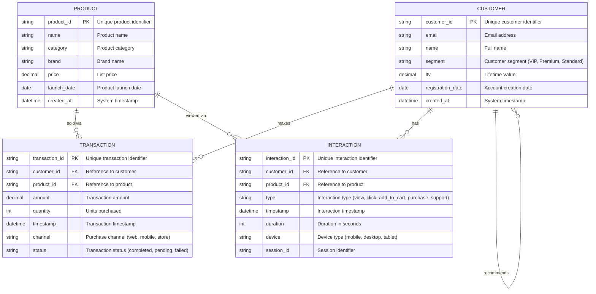
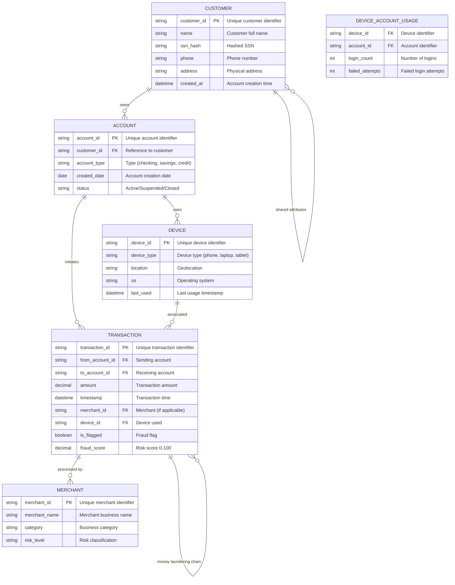

# Data Model

Comprehensive data models for Customer 360 and Fraud Detection use cases with ER diagrams, schema definitions, and relationship specifications.

---

## Customer 360 Data Model

Entity-relationship model for unified customer behavior analysis combining transactions, products, and interactions.

### ER Diagram



### Table Descriptions

#### CUSTOMER Table

**Purpose:** Central entity representing individual customers with demographic and value information.

**Columns:**

| Column | Type | Description | Key | Index |
|--------|------|-------------|-----|-------|
| customer_id | String | Unique customer identifier | Primary | Yes |
| email | String | Customer email address | Unique | Yes |
| name | String | Full name of customer | - | No |
| segment | String | Customer segment classification | - | Yes |
| ltv | Decimal(10,2) | Lifetime value (total spending potential) | - | No |
| registration_date | Date | Account creation date | - | Yes |
| created_at | DateTime | System creation timestamp | - | No |

**Constraints:**
- `customer_id`: NOT NULL, UNIQUE
- `email`: NOT NULL
- `name`: NOT NULL
- `segment`: IN ('VIP', 'Premium', 'Standard', 'Inactive')
- `ltv`: >= 0

**Typical Queries:**
- Segment analysis and customer counting
- Lifetime value distribution
- Registration trend analysis
- High-value customer identification

**Sample Data:**
```
CUST_001 | john.doe@example.com | John Doe | VIP | 45000.00 | 2023-01-15 | 2023-01-15 10:30:45
CUST_002 | jane.smith@example.com | Jane Smith | Premium | 12500.00 | 2023-02-20 | 2023-02-20 14:22:10
```

---

#### PRODUCT Table

**Purpose:** Product catalog with pricing, categorization, and brand information.

**Columns:**

| Column | Type | Description | Key | Index |
|--------|------|-------------|-----|-------|
| product_id | String | Unique product identifier | Primary | Yes |
| name | String | Product name | - | Yes |
| category | String | Product category | - | Yes |
| brand | String | Brand/manufacturer | - | Yes |
| price | Decimal(10,2) | List price | - | No |
| launch_date | Date | Product launch date | - | Yes |
| created_at | DateTime | System creation timestamp | - | No |

**Constraints:**
- `product_id`: NOT NULL, UNIQUE
- `name`: NOT NULL
- `category`: NOT NULL
- `brand`: NOT NULL
- `price`: > 0

**Typical Queries:**
- Category performance analysis
- Brand affinity studies
- Price range analytics
- Product launch trends

**Sample Data:**
```
PROD_001 | Wireless Headphones | Electronics | BrandX | 99.99 | 2023-06-01 | 2023-06-01 08:15:00
PROD_002 | Coffee Maker | Appliances | BrandY | 149.99 | 2023-07-15 | 2023-07-15 09:45:30
```

---

#### TRANSACTION Table

**Purpose:** Record of all customer purchases with amounts, channels, and completion status.

**Columns:**

| Column | Type | Description | Key | Index |
|--------|------|-------------|-----|-------|
| transaction_id | String | Unique transaction identifier | Primary | Yes |
| customer_id | String | Reference to CUSTOMER | Foreign | Yes |
| product_id | String | Reference to PRODUCT | Foreign | Yes |
| amount | Decimal(10,2) | Transaction amount | - | No |
| quantity | UInt32 | Number of units purchased | - | No |
| timestamp | DateTime | Transaction timestamp | - | Yes |
| channel | String | Purchase channel | - | Yes |
| status | String | Transaction status | - | Yes |

**Constraints:**
- `transaction_id`: NOT NULL, UNIQUE
- `customer_id`: NOT NULL, FOREIGN KEY
- `product_id`: NOT NULL, FOREIGN KEY
- `amount`: > 0
- `quantity`: > 0
- `channel`: IN ('web', 'mobile', 'store', 'call_center')
- `status`: IN ('completed', 'pending', 'failed', 'cancelled')

**Indexes:**
- (customer_id, timestamp): Time-series queries per customer
- (product_id): Product analytics
- (timestamp): Period-based rollups

**Typical Queries:**
- Revenue by time period
- Customer purchase behavior
- Product performance metrics
- Channel attribution analysis

**Sample Data:**
```
TXN_001 | CUST_001 | PROD_001 | 99.99 | 1 | 2024-01-15 10:30:00 | web | completed
TXN_002 | CUST_001 | PROD_002 | 149.99 | 1 | 2024-01-16 14:22:00 | mobile | completed
```

---

#### INTERACTION Table

**Purpose:** Record of all customer-product interactions (views, clicks, purchases, support).

**Columns:**

| Column | Type | Description | Key | Index |
|--------|------|-------------|-----|-------|
| interaction_id | String | Unique interaction identifier | Primary | Yes |
| customer_id | String | Reference to CUSTOMER | Foreign | Yes |
| product_id | String | Reference to PRODUCT | Foreign | Yes |
| type | String | Type of interaction | - | Yes |
| timestamp | DateTime | Interaction timestamp | - | Yes |
| duration | UInt32 | Duration in seconds | - | No |
| device | String | Device type | - | Yes |
| session_id | String | Session identifier | - | Yes |

**Constraints:**
- `interaction_id`: NOT NULL, UNIQUE
- `customer_id`: NOT NULL, FOREIGN KEY
- `product_id`: NOT NULL, FOREIGN KEY
- `type`: IN ('view', 'click', 'add_to_cart', 'purchase', 'support', 'review')
- `duration`: >= 0
- `device`: IN ('mobile', 'desktop', 'tablet', 'unknown')

**Indexes:**
- (customer_id, timestamp): Customer journey analysis
- (product_id, type): Product engagement
- (session_id): Session reconstruction

**Typical Queries:**
- Engagement scoring
- Product affinity analysis
- Device usage patterns
- Session reconstruction
- Funnel analysis

**Sample Data:**
```
INT_001 | CUST_001 | PROD_001 | view | 2024-01-15 10:00:00 | 45 | desktop | SESS_123
INT_002 | CUST_001 | PROD_001 | click | 2024-01-15 10:01:00 | 10 | desktop | SESS_123
INT_003 | CUST_001 | PROD_001 | purchase | 2024-01-15 10:30:00 | 120 | desktop | SESS_123
```

---

### Relationship Definitions

#### CUSTOMER -> TRANSACTION (makes)
- **Cardinality:** One-to-Many (1:N)
- **Type:** Parent-Child
- **Description:** Customer makes zero or more transactions
- **Query Example:**
```sql
SELECT c.name, COUNT(t.transaction_id) as purchase_count
FROM customers c
LEFT JOIN transactions t ON c.customer_id = t.customer_id
GROUP BY c.customer_id
```

#### CUSTOMER -> INTERACTION (has)
- **Cardinality:** One-to-Many (1:N)
- **Type:** Parent-Child
- **Description:** Customer has zero or more interactions across products
- **Query Example:**
```sql
SELECT c.name, COUNT(DISTINCT i.interaction_type) as engagement_types
FROM customers c
LEFT JOIN interactions i ON c.customer_id = i.customer_id
GROUP BY c.customer_id
```

#### PRODUCT -> TRANSACTION (sold via)
- **Cardinality:** One-to-Many (1:N)
- **Type:** Parent-Child
- **Description:** Product appears in zero or more transactions
- **Query Example:**
```sql
SELECT p.name, COUNT(t.transaction_id) as sales_count
FROM products p
LEFT JOIN transactions t ON p.product_id = t.product_id
GROUP BY p.product_id
```

#### PRODUCT -> INTERACTION (viewed via)
- **Cardinality:** One-to-Many (1:N)
- **Type:** Parent-Child
- **Description:** Product receives zero or more interaction events
- **Query Example:**
```sql
SELECT p.name,
       COUNT(CASE WHEN i.type = 'view' THEN 1 END) as view_count,
       COUNT(CASE WHEN i.type = 'purchase' THEN 1 END) as purchase_count
FROM products p
LEFT JOIN interactions i ON p.product_id = i.product_id
GROUP BY p.product_id
```

#### CUSTOMER -> CUSTOMER (recommends)
- **Cardinality:** Many-to-Many (N:M)
- **Type:** Derived (via product affinity)
- **Description:** Customer recommends products to similar customers
- **Implementation:** Inferred from shared purchases/interests
- **Query Example (Cypher):**
```cypher
MATCH (c1:Customer)-[:PURCHASED]->(p:Product)<-[:PURCHASED]-(c2:Customer)
WHERE c1.customer_id < c2.customer_id
RETURN c1, c2, COUNT(p) as shared_products
ORDER BY shared_products DESC
```

---

### Graph Schema (PuppyGraph)

**Vertices:**
```json
{
  "label": "Customer",
  "source": "customers",
  "id_column": "customer_id",
  "properties": ["email", "name", "segment", "ltv", "registration_date"]
}
```

```json
{
  "label": "Product",
  "source": "products",
  "id_column": "product_id",
  "properties": ["name", "category", "brand", "price", "launch_date"]
}
```

**Edges:**
```json
{
  "label": "PURCHASED",
  "source": "transactions",
  "from": "customer_id",
  "to": "product_id",
  "filter": "status = 'completed'",
  "properties": ["amount", "timestamp", "channel"]
}
```

```json
{
  "label": "VIEWED",
  "source": "interactions",
  "from": "customer_id",
  "to": "product_id",
  "filter": "type = 'view'",
  "properties": ["timestamp", "duration", "device"]
}
```

---

## Fraud Detection Data Model

Comprehensive model for fraud detection with accounts, transactions, devices, and fraud indicators.

### ER Diagram



### Table Descriptions

#### CUSTOMER Table (Fraud Context)

**Purpose:** Customer identities with personal information for fraud correlation.

**Columns:**

| Column | Type | Description | Key | Index |
|--------|------|-------------|-----|-------|
| customer_id | String | Unique customer identifier | Primary | Yes |
| name | String | Customer full name | - | No |
| ssn_hash | String | Hashed SSN for matching | - | Yes |
| phone | String | Phone number | - | Yes |
| address | String | Physical address | - | Yes |
| created_at | DateTime | Account creation timestamp | - | Yes |

**Constraints:**
- `customer_id`: NOT NULL, UNIQUE
- `ssn_hash`: NOT NULL
- `phone`: NOT NULL
- `address`: NOT NULL

**Indexes:**
- `ssn_hash`: Identity fraud detection
- `phone`: Account sharing detection
- `address`: Location fraud detection
- `created_at`: New account analysis

**Fraud Indicators:**
- Duplicate SSN across customers (identity theft)
- Same phone/address with recent accounts (synthetic fraud)
- Multiple accounts created rapidly (fraud ring setup)

---

#### ACCOUNT Table

**Purpose:** Individual accounts belonging to customers with status tracking.

**Columns:**

| Column | Type | Description | Key | Index |
|--------|------|-------------|-----|-------|
| account_id | String | Unique account identifier | Primary | Yes |
| customer_id | String | Reference to CUSTOMER | Foreign | Yes |
| account_type | String | Account type | - | No |
| created_date | Date | Account creation date | - | Yes |
| status | String | Account status | - | Yes |

**Constraints:**
- `account_id`: NOT NULL, UNIQUE
- `customer_id`: NOT NULL, FOREIGN KEY
- `account_type`: IN ('checking', 'savings', 'credit', 'debit')
- `status`: IN ('active', 'suspended', 'closed', 'locked')

**Fraud Indicators:**
- Multiple accounts created on same day
- Accounts created just before fraudulent activity
- Accounts with rapid suspension history
- Accounts linked to flagged customers

---

#### TRANSACTION Table (Fraud Context)

**Purpose:** All account transactions with fraud scoring and merchant details.

**Columns:**

| Column | Type | Description | Key | Index |
|--------|------|-------------|-----|-------|
| transaction_id | String | Unique transaction identifier | Primary | Yes |
| from_account_id | String | Sending account | Foreign | Yes |
| to_account_id | String | Receiving account (null for merchant) | Foreign | - |
| amount | Decimal(12,2) | Transaction amount | - | No |
| timestamp | DateTime | Transaction timestamp | - | Yes |
| merchant_id | String | Merchant reference | Foreign | Yes |
| device_id | String | Device used | Foreign | Yes |
| is_flagged | Boolean | Manual fraud flag | - | Yes |
| fraud_score | Decimal(5,2) | Automated risk score 0-100 | - | Yes |

**Constraints:**
- `transaction_id`: NOT NULL, UNIQUE
- `from_account_id`: NOT NULL, FOREIGN KEY
- `amount`: > 0
- `fraud_score`: BETWEEN 0 AND 100

**Indexes:**
- (from_account_id, timestamp): Velocity analysis
- (timestamp): Burst detection
- (to_account_id): Chain detection
- (device_id): Device linking
- (fraud_score): Risk ranking

**Fraud Indicators:**
- High velocity: Many transactions in short time
- Round amounts: 1000, 5000, 10000, etc.
- Geographic impossibilities: Same user in different locations
- Money laundering chains: Sequential transfers
- Shared devices: Same device across accounts
- Burst patterns: Unusual activity spikes

---

#### DEVICE Table

**Purpose:** Devices used for account access with geolocation and OS information.

**Columns:**

| Column | Type | Description | Key | Index |
|--------|------|-------------|-----|-------|
| device_id | String | Unique device identifier | Primary | Yes |
| device_type | String | Type of device | - | No |
| location | String | Geolocation | - | Yes |
| os | String | Operating system | - | No |
| last_used | DateTime | Last usage timestamp | - | Yes |

**Constraints:**
- `device_id`: NOT NULL, UNIQUE
- `device_type`: IN ('phone', 'laptop', 'tablet', 'atm', 'pos')

**Fraud Indicators:**
- Shared devices across multiple accounts
- Devices with geographic jumps
- New devices with immediate fraud activity
- Multiple accounts logging in from same device

---

#### MERCHANT Table

**Purpose:** Merchant information for transaction correlation and pattern analysis.

**Columns:**

| Column | Type | Description | Key | Index |
|--------|------|-------------|-----|-------|
| merchant_id | String | Unique merchant identifier | Primary | Yes |
| merchant_name | String | Business name | - | No |
| category | String | Business category | - | Yes |
| risk_level | String | Pre-computed risk level | - | Yes |

**Constraints:**
- `merchant_id`: NOT NULL, UNIQUE
- `merchant_name`: NOT NULL
- `category`: NOT NULL
- `risk_level`: IN ('low', 'medium', 'high', 'unknown')

**Fraud Indicators:**
- High approval rate (>95% for flagged transactions)
- New merchants with high transaction volume
- Merchants in high-risk categories
- Merchants accepting unusual payment patterns

---

#### DEVICE_ACCOUNT_USAGE Table

**Purpose:** Junction table tracking device-account relationships for correlation analysis.

**Columns:**

| Column | Type | Description | Key | Index |
|--------|------|-------------|-----|-------|
| device_id | String | Reference to DEVICE | Foreign | Yes |
| account_id | String | Reference to ACCOUNT | Foreign | Yes |
| login_count | Int | Number of successful logins | - | No |
| failed_attempts | Int | Number of failed login attempts | - | No |

**Constraints:**
- (device_id, account_id): Composite primary key
- `login_count`: >= 0
- `failed_attempts`: >= 0

**Fraud Indicators:**
- Single device accessing 5+ accounts
- High failed login attempts
- Devices with sudden account proliferation
- Devices accessing both normal and suspicious accounts

---

### Relationship Definitions

#### CUSTOMER -> ACCOUNT (owns)
- **Cardinality:** One-to-Many (1:N)
- **Type:** Parent-Child
- **Description:** Customer owns one or more accounts
- **Query Example:**
```sql
SELECT c.name, COUNT(a.account_id) as account_count
FROM customers c
JOIN accounts a ON c.customer_id = a.customer_id
GROUP BY c.customer_id
HAVING account_count > 1
```

#### ACCOUNT -> TRANSACTION (initiates)
- **Cardinality:** One-to-Many (1:N)
- **Type:** Parent-Child
- **Description:** Account initiates zero or more transactions
- **Query Example:**
```sql
SELECT a.account_id,
       COUNT(t.transaction_id) as transaction_count,
       SUM(t.amount) as total_volume
FROM accounts a
LEFT JOIN transactions t ON a.account_id = t.from_account_id
GROUP BY a.account_id
ORDER BY transaction_count DESC
```

#### ACCOUNT -> DEVICE (uses)
- **Cardinality:** Many-to-Many (N:M)
- **Through:** DEVICE_ACCOUNT_USAGE
- **Type:** Cross-reference
- **Description:** Account uses multiple devices, device used by multiple accounts
- **Query Example:**
```sql
SELECT a.account_id,
       COUNT(DISTINCT d.device_id) as unique_devices,
       SUM(dau.login_count) as total_logins
FROM accounts a
JOIN device_account_usage dau ON a.account_id = dau.account_id
JOIN devices d ON dau.device_id = d.device_id
GROUP BY a.account_id
HAVING unique_devices > 5
```

#### TRANSACTION -> MERCHANT (processed by)
- **Cardinality:** Many-to-One (N:1)
- **Type:** Child-Parent
- **Description:** Multiple transactions processed by merchant
- **Query Example:**
```sql
SELECT m.merchant_id, m.merchant_name,
       COUNT(t.transaction_id) as transaction_count,
       SUM(CASE WHEN t.is_flagged THEN 1 ELSE 0 END) as flagged_count
FROM merchants m
JOIN transactions t ON m.merchant_id = t.merchant_id
GROUP BY m.merchant_id
ORDER BY flagged_count DESC
```

#### TRANSACTION -> TRANSACTION (money laundering chain)
- **Cardinality:** Self-referencing Many-to-Many (N:M)
- **Type:** Derived
- **Description:** Sequential transactions form money laundering chains
- **Recursive Query Example:**
```sql
WITH RECURSIVE chains AS (
    SELECT transaction_id, from_account_id, to_account_id, amount, 1 as depth
    FROM transactions
    WHERE amount > 10000
    UNION ALL
    SELECT t.transaction_id, t.from_account_id, t.to_account_id, t.amount, c.depth + 1
    FROM transactions t
    JOIN chains c ON t.from_account_id = c.to_account_id
    WHERE c.depth < 5
)
SELECT * FROM chains WHERE depth >= 3
```

#### CUSTOMER -> CUSTOMER (shared attributes)
- **Cardinality:** Many-to-Many (N:M)
- **Type:** Derived
- **Description:** Customers sharing SSN, phone, or address (synthetic identity/fraud ring)
- **Query Example (Cypher):**
```cypher
MATCH (c1:Customer)-[:SHARES_SSN|SHARES_PHONE|SHARES_ADDRESS]-(c2:Customer)
WHERE c1.customer_id < c2.customer_id
RETURN c1, c2, COUNT(*) as shared_attributes
ORDER BY shared_attributes DESC
```

---

### Graph Schema (PuppyGraph)

**Vertices:**
```json
{
  "label": "Customer",
  "source": "customers",
  "id_column": "customer_id",
  "properties": ["name", "ssn_hash", "phone", "address", "created_at"]
}
```

```json
{
  "label": "Account",
  "source": "accounts",
  "id_column": "account_id",
  "properties": ["customer_id", "account_type", "status", "created_date"]
}
```

```json
{
  "label": "Transaction",
  "source": "transactions",
  "id_column": "transaction_id",
  "properties": ["amount", "timestamp", "is_flagged", "fraud_score"]
}
```

```json
{
  "label": "Device",
  "source": "devices",
  "id_column": "device_id",
  "properties": ["device_type", "location", "os", "last_used"]
}
```

```json
{
  "label": "Merchant",
  "source": "merchants",
  "id_column": "merchant_id",
  "properties": ["merchant_name", "category", "risk_level"]
}
```

**Edges:**
```json
{
  "label": "OWNS",
  "source": "accounts",
  "from": "customer_id",
  "to": "account_id",
  "properties": ["created_date", "status"]
}
```

```json
{
  "label": "TRANSACTED",
  "source": "transactions",
  "from": "from_account_id",
  "to": "to_account_id",
  "properties": ["amount", "timestamp", "fraud_score"]
}
```

```json
{
  "label": "USED_DEVICE",
  "source": "device_account_usage",
  "from": "account_id",
  "to": "device_id",
  "properties": ["login_count", "failed_attempts"]
}
```

```json
{
  "label": "PROCESSED_BY",
  "source": "transactions",
  "from": "transaction_id",
  "to": "merchant_id",
  "properties": ["amount", "timestamp"]
}
```

```json
{
  "label": "SHARES_SSN",
  "source": "customers",
  "from": "customer_id",
  "to": "customer_id",
  "filter": "ssn_hash match",
  "properties": ["ssn_hash"]
}
```

```json
{
  "label": "SHARES_PHONE",
  "source": "customers",
  "from": "customer_id",
  "to": "customer_id",
  "filter": "phone match",
  "properties": ["phone"]
}
```

```json
{
  "label": "SHARES_ADDRESS",
  "source": "customers",
  "from": "customer_id",
  "to": "customer_id",
  "filter": "address match",
  "properties": ["address"]
}
```

---

## Index Strategy

### ClickHouse Indexes

**Primary Key Indexes (Automatic):**
- Customer360: `(customer_id)` - Fast customer lookups
- Fraud: `(from_account_id, timestamp)` - Velocity analysis

**Secondary Indexes (MergeTree features):**
- Skip indices on timestamp columns (month-based granularity)
- Bloom filter indices on categorical columns (segment, category, device_type)
- Min-Max indices on numeric columns (amount, fraud_score)

**Query Optimization:**
```sql
-- Verify index usage
EXPLAIN SELECT * FROM transactions
WHERE customer_id = 'CUST_001' AND timestamp > NOW() - INTERVAL 30 DAY

-- Check table structure and indices
DESC TABLE transactions
```

### PuppyGraph Indexes

**Vertex Indexes:**
- `customer_id` (hash): Fast customer lookups
- `account_id` (hash): Fast account lookups
- `merchant_id` (hash): Fast merchant lookups

**Edge Indexes:**
- `(from_id, to_id)`: Bidirectional traversal
- Timestamp: Time-based filtering

**Pattern Index Optimization:**
- Pre-compute frequent patterns (fraud rings, recommendation paths)
- Materialized views for common aggregations
- Cache frequently accessed subgraphs

---

## Data Volumes and Cardinality

### Customer 360 Scale (100K Customers)

| Table | Records | Size (GB) | Avg Row Size | Index Size |
|-------|---------|-----------|--------------|-----------|
| customers | 100K | 0.01 | 150 bytes | 0.002 |
| products | 10K | 0.001 | 200 bytes | 0.001 |
| transactions | 1M | 0.2 | 250 bytes | 0.03 |
| interactions | 5M | 0.8 | 200 bytes | 0.1 |
| **TOTAL** | **6.1M** | **~1.0** | - | **0.13** |

### Fraud Detection Scale (100K Customers)

| Table | Records | Size (GB) | Avg Row Size | Index Size |
|-------|---------|-----------|--------------|-----------|
| customers | 100K | 0.01 | 200 bytes | 0.003 |
| accounts | 300K | 0.03 | 150 bytes | 0.005 |
| transactions | 2M | 0.5 | 300 bytes | 0.08 |
| merchants | 20K | 0.002 | 200 bytes | 0.001 |
| devices | 50K | 0.008 | 180 bytes | 0.002 |
| device_account_usage | 150K | 0.02 | 100 bytes | 0.003 |
| **TOTAL** | **2.62M** | **~0.6** | - | **0.1** |

---

## Data Quality Rules

### Integrity Constraints

**Customer360:**
1. All transactions must reference valid customers and products
2. Lifetime value must be >= 0
3. Transaction timestamp must be after customer registration
4. Interaction timestamp must align with transaction flow

**Fraud Detection:**
1. All transactions must reference valid accounts
2. from_account_id != to_account_id (no self-transfers)
3. Amount must be positive
4. fraud_score must be 0-100
5. Device must exist before first usage

### Referential Integrity

```sql
-- Customer360
ALTER TABLE transactions ADD CONSTRAINT
FOREIGN KEY (customer_id) REFERENCES customers(customer_id);

ALTER TABLE transactions ADD CONSTRAINT
FOREIGN KEY (product_id) REFERENCES products(product_id);

ALTER TABLE interactions ADD CONSTRAINT
FOREIGN KEY (customer_id) REFERENCES customers(customer_id);

ALTER TABLE interactions ADD CONSTRAINT
FOREIGN KEY (product_id) REFERENCES products(product_id);

-- Fraud Detection
ALTER TABLE accounts ADD CONSTRAINT
FOREIGN KEY (customer_id) REFERENCES customers(customer_id);

ALTER TABLE transactions ADD CONSTRAINT
FOREIGN KEY (from_account_id) REFERENCES accounts(account_id);
```

### Data Validation

```sql
-- Check for orphaned transactions
SELECT COUNT(*) FROM transactions
WHERE customer_id NOT IN (SELECT customer_id FROM customers);

-- Identify impossible timestamps
SELECT COUNT(*) FROM transactions t
WHERE t.timestamp < (
    SELECT registration_date FROM customers c WHERE c.customer_id = t.customer_id
);

-- Check fraud score validity
SELECT COUNT(*) FROM transactions WHERE fraud_score < 0 OR fraud_score > 100;
```

---

## Partitioning Strategy

### Time-Based Partitioning

**ClickHouse Partitioning:**
```sql
-- Monthly partitioning for transactions (recommended)
CREATE TABLE transactions (
    ...
) ENGINE = MergeTree()
PARTITION BY toYYYYMM(timestamp)
ORDER BY (customer_id, timestamp)
```

**Benefits:**
- Fast monthly data purging
- Parallel reads across partitions
- Better compression per partition
- Quick date range queries

### Sharding Strategy (for ClickHouse clusters)

```
Shard 1: customer_id hash % 4 = 0,1
Shard 2: customer_id hash % 4 = 2,3
```

---

## Backup and Recovery

### Backup Strategy

**Frequency:** Daily incremental, Weekly full backup

**Backup Methods:**

```bash
# Full backup via ClickHouse
clickhouse-backup create backup_name

# Export to CSV
clickhouse-client --query "SELECT * FROM customers" > customers_backup.csv

# Incremental via replication logs
# (if using ClickHouse Keeper)
```

### Recovery Procedures

```bash
# Restore from backup
clickhouse-backup restore backup_name

# Restore from CSV
cat customers_backup.csv | clickhouse-client --query "INSERT INTO customers FORMAT CSV"

# Point-in-time recovery
# Use mutation logs in ClickHouse Keeper
```

---

## Audit and Compliance

### Data Access Logging

```sql
-- Track data modifications
ALTER TABLE transactions ADD COLUMN
  audit_timestamp DateTime DEFAULT now() CODEC(DoubleDelta);

ALTER TABLE transactions ADD COLUMN
  audit_user String;

-- Query log for compliance
SELECT * FROM system.query_log
WHERE database = 'customer360'
AND type = 'QueryFinish'
ORDER BY event_time DESC;
```

### PII Protection

- SSN hash storage (not plaintext)
- Phone/address encryption at rest
- Query result masking for sensitive fields
- Audit logging for data access

---

## Future Schema Evolution

### Planned Enhancements

1. **Real-time Streaming:**
   - Add event_source column to track data origin
   - Time-series optimization for streaming tables

2. **ML Features:**
   - Add prediction columns for ML model outputs
   - Feature engineering tables

3. **Advanced Fraud Detection:**
   - Behavioral profiles table
   - Anomaly scores table
   - Multi-factor risk assessment tables

4. **Retention Policies:**
   - TTL (Time-To-Live) for older transactions
   - Archive partition strategy
   - Compliance retention periods
