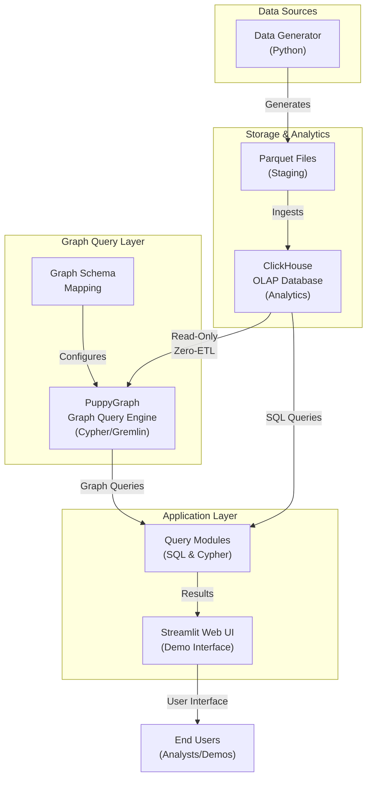
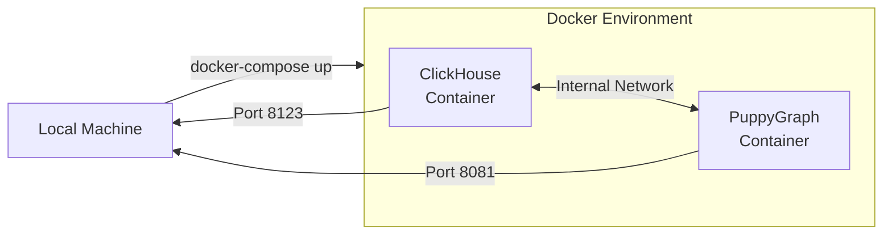
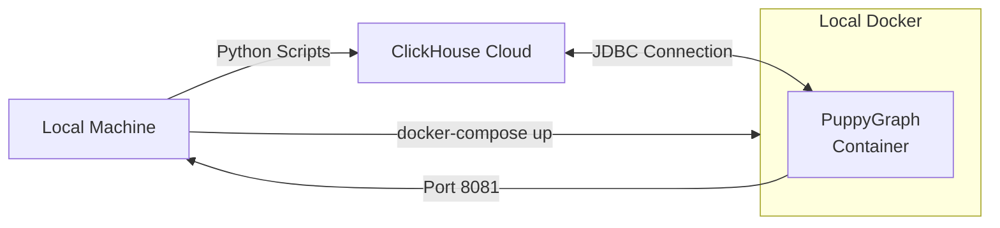
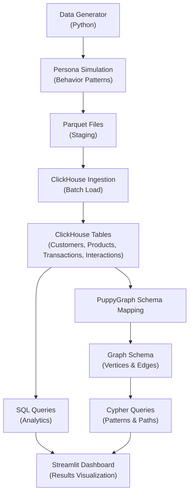
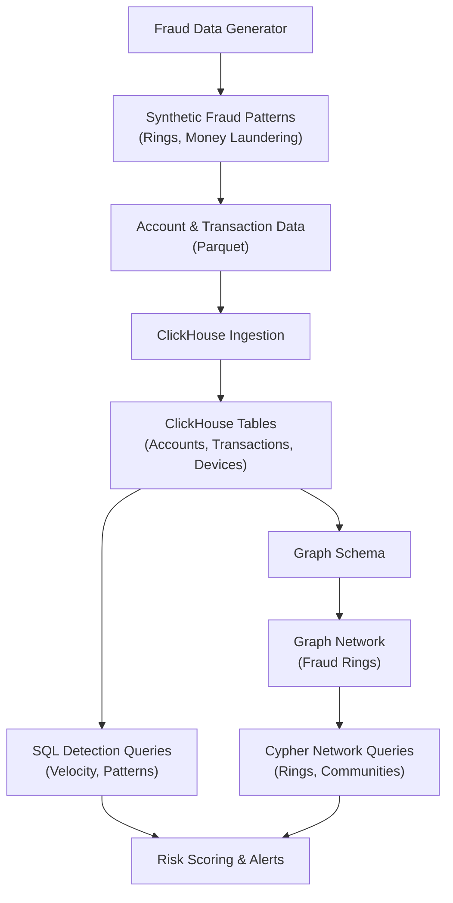

# System Overview

Comprehensive system architecture for the PuppyGraph + ClickHouse demonstration platform supporting Customer 360 and Fraud Detection use cases.

---

## Architecture Overview



---

## Component Architecture

### 1. Data Generation Layer

**Purpose:** Generate realistic datasets for Customer 360 and Fraud Detection use cases.

**Components:**
- **generator.py**: Main data generation orchestrator
- **persona_generator.py**: Customer persona and behavior simulation
- **Faker Library**: Realistic data synthesis
- **Configuration**: `data.env.example` for generation parameters

**Capabilities:**
- Configurable customer scales: 100K to 100M+ records
- Multiple use-case generation: Customer360, Fraud-Detection, or both
- Batch file output in Parquet format
- Deterministic generation with seed support
- Compression options: snappy, gzip, lz4

---

### 2. ClickHouse OLAP Database

**Purpose:** High-performance analytical database for transaction and customer data.

**Key Characteristics:**
- Column-oriented storage
- SQL query interface
- Real-time data ingestion via Parquet
- Zero-ETL integration with PuppyGraph

**Data Tables:**

#### Customer360 Schema
```
customers: customer_id, email, name, segment, ltv, registration_date
products: product_id, name, category, brand, price, launch_date
transactions: transaction_id, customer_id, product_id, amount, quantity, timestamp, channel, status
interactions: interaction_id, customer_id, product_id, type, timestamp, duration, device, session_id
```

#### Fraud Detection Schema
```
accounts: account_id, customer_id, account_type, created_date, status
customers: customer_id, name, ssn_hash, phone, address, created_at
merchants: merchant_id, merchant_name, category, risk_level
transactions: transaction_id, from_account_id, to_account_id, amount, timestamp,
              merchant_id, device_id, is_flagged, fraud_score
devices: device_id, device_type, location, os, last_used
device_account_usage: device_id, account_id, login_count, failed_attempts
```

**Access:** HTTP port 8123 (local) or ClickHouse Cloud endpoint

---

### 3. PuppyGraph Graph Query Engine

**Purpose:** Zero-ETL graph query layer on top of ClickHouse without data duplication.

**Key Features:**
- Maps ClickHouse tables to graph vertices and edges
- Supports Cypher and Gremlin query languages
- Real-time graph traversal performance
- Pattern matching for fraud detection and recommendations

**Graph Mappings:**

**Vertices:**
- Customer: Maps to customers table
- Product: Maps to products table
- Account: Maps to accounts table (fraud)
- Device: Maps to devices table (fraud)
- Merchant: Maps to merchants table (fraud)

**Edges:**
- PURCHASED: customer -> product (via transactions)
- VIEWED: customer -> product (via interactions)
- SHARES_EMAIL|PHONE|ADDRESS: customer -> customer (fraud indicators)
- TRANSACTED: account -> account (via transactions)
- USED_DEVICE: account -> device
- PROCESSED_BY: transaction -> merchant

**Configuration:** Defined in `puppygraph-schema.json` (auto-generated)

**Access:** Web UI (port 8081), Cypher protocol (port 7687)

---

### 4. Application Query Layer

**Purpose:** Execute both SQL and graph queries for analytics and demonstrations.

**Modules:**

#### SQL Query Executor
- Direct ClickHouse SQL queries
- Analytical aggregations and joins
- Performance: optimized for OLAP workloads

#### Graph Query Executor
- Cypher query parsing and execution
- Pattern matching for fraud rings and networks
- Recommendation path traversal
- Performance: millisecond-level execution

#### Query Examples

**Customer 360 - SQL (ClickHouse)**
```sql
SELECT
    segment, COUNT(*) as customers,
    AVG(ltv) as avg_ltv
FROM customers
GROUP BY segment
```

**Customer 360 - Cypher (PuppyGraph)**
```cypher
MATCH (c:Customer)-[:PURCHASED]->(p:Product)
RETURN c.name, COUNT(p) as products_purchased
ORDER BY products_purchased DESC
```

**Fraud Detection - Cypher (PuppyGraph)**
```cypher
MATCH (c1:Customer)-[:SHARES_EMAIL|SHARES_PHONE|SHARES_ADDRESS]-(c2:Customer)
WHERE c1.customer_id < c2.customer_id
RETURN c1, c2, COUNT(*) as shared_attributes
```

---

## Deployment Patterns

### Pattern 1: Local Deployment (Development/Demo)



**Architecture:**
- Both ClickHouse and PuppyGraph run as Docker containers
- Internal container networking for zero-latency communication
- Data generation runs inside ClickHouse container
- Local file volumes for data persistence

**Deployment Files:**
- `deployments/local/docker-compose.yml`: Container orchestration
- `deployments/local/Dockerfile.clickhouse`: Custom ClickHouse image with Python
- `deployments/local/README.md`: Setup instructions

**Advantages:**
- Single-command deployment
- No cloud dependencies
- Full control and customization
- Perfect for development and local testing

**Start:**
```bash
make local
make generate-local
```

---

### Pattern 2: Hybrid Deployment (ClickHouse Cloud + Local PuppyGraph)



**Architecture:**
- ClickHouse database hosted in ClickHouse Cloud
- PuppyGraph runs locally as Docker container
- Data generation and ingestion via Python on local machine
- Remote JDBC connection between PuppyGraph and ClickHouse Cloud

**Deployment Files:**
- `deployments/hybrid/docker-compose.yml`: PuppyGraph container only
- `deployments/hybrid/.env.example`: Cloud credentials template
- `deployments/hybrid/README.md`: Setup and configuration guide

**Advantages:**
- Managed cloud database (no infrastructure management)
- Local development/testing with production data
- Scalable storage in cloud
- Cost-effective for non-production use

**Configuration:**
```bash
cp deployments/hybrid/.env.example deployments/hybrid/.env
# Edit with ClickHouse Cloud credentials
make hybrid
make generate-hybrid
```

---

### Pattern 3: Cloud-Native Deployment (Future)

Roadmap for fully cloud-hosted solution:
- ClickHouse Cloud: Managed database
- PuppyGraph Cloud: Managed graph engine
- Kubernetes orchestration
- Auto-scaling based on query load
- Global distribution support

---

## Data Flow Architecture

### Customer 360 Data Pipeline



**Key Stages:**

1. **Generation**: Customer personas with realistic behavior (purchase patterns, interests)
2. **Staging**: Export to Parquet format with configurable batch sizes
3. **Ingestion**: Load via ClickHouse driver with batch processing
4. **Schema Mapping**: Define graph relationships from relational tables
5. **Analysis**: Run analytical queries (SQL) and pattern queries (Cypher)
6. **Visualization**: Display results in interactive dashboard

---

### Fraud Detection Data Pipeline



**Detection Strategies:**

1. **SQL-Based (Fast Initial Filter):**
   - Shared device detection
   - Velocity checks (high transaction volume)
   - Geographic impossibilities
   - Round-number transactions

2. **Graph-Based (Deep Pattern Detection):**
   - Fraud ring identification (shared attributes)
   - Money laundering chains
   - Coordinated attack detection
   - PageRank for network influence

3. **Risk Scoring:**
   - Composite score from multiple indicators
   - 0-100 scale for classification
   - Real-time calculation for new transactions

---

## Integration Points

### 1. Data Ingestion Interface

**Input Formats:**
- Parquet files (primary)
- CSV (with type conversion)
- Direct Python objects (DataFrames)

**Batch Control:**
- Configurable batch sizes (default: 10,000 records)
- Retry logic with exponential backoff
- Progress tracking via tqdm

**Configuration:**
```python
# Environment variables control ingestion behavior
INGESTION_BATCH_SIZE=10000
INGESTION_RETRY_ATTEMPTS=3
INGESTION_RETRY_DELAY=5
DROP_EXISTING_TABLES=false
TRUNCATE_BEFORE_LOAD=false
```

---

### 2. Query Interface

**ClickHouse SQL Interface:**
- HTTP: POST to /query endpoint
- TCP/Native: Direct protocol
- HTTPS/SSL: Secure connections
- JDBC: For PuppyGraph integration

**PuppyGraph Cypher Interface:**
- Bolt Protocol: Native Cypher execution
- HTTP: REST-based queries
- Web Browser: Interactive query editor

**Python Integration:**
```python
# ClickHouse direct connection
from clickhouse_driver import Client
client = Client(host, port, user, password, database)

# PuppyGraph via Neo4j driver
from neo4j import GraphDatabase
driver = GraphDatabase.driver(uri, auth=(user, pwd))
```

---

### 3. Configuration Management

**Environment Variables:**

**ClickHouse Configuration:**
```
CLICKHOUSE_HOST: Database host
CLICKHOUSE_PORT: Database port (default: 9440 for SSL)
CLICKHOUSE_USER: Username (default: default)
CLICKHOUSE_PASSWORD: Authentication password
CLICKHOUSE_DATABASE: Database name (default: customer360)
```

**PuppyGraph Configuration:**
```
PUPPYGRAPH_URI: Connection URI (default: bolt://localhost:7687)
PUPPYGRAPH_USER: Username (default: neo4j)
PUPPYGRAPH_PASSWORD: Password
```

**Data Generation:**
```
CUSTOMERS_SCALE: 100K|1M|10M|100M
BATCH_SIZE: Parquet batch size
RANDOM_SEED: For reproducibility
COMPRESSION: snappy|gzip|lz4
```

---

## Performance Characteristics

### ClickHouse Performance

**Query Type:** Analytical (OLAP)
**Latency:** 10ms-1s for aggregations
**Throughput:** Billions of rows per second
**Storage:** Columnar compression (10-100x compression)

**Optimization:**
- Primary key: customer_id, timestamp
- Data skipping indices
- Read-only access pattern

### PuppyGraph Performance

**Query Type:** Graph Traversal (OLTP-like)
**Latency:** <100ms for typical patterns
**Traversal Depth:** 1-4 hops typical, up to 10+ for deep analysis
**Pattern Matching:** Milliseconds for ring detection

**Optimization:**
- Zero-ETL: No network round-trips for data
- Native graph storage on ClickHouse
- Index structures on vertex/edge tables

---

## Scalability Considerations

| Component | Small (100K) | Medium (1M) | Large (10M) | Enterprise (100M+) |
|-----------|--------------|-------------|-------------|-------------------|
| ClickHouse Storage | 1-2 GB | 10-20 GB | 100-200 GB | 1-5 TB |
| RAM Required | 4 GB | 8 GB | 16-32 GB | 64+ GB |
| Ingestion Time | 5 min | 30 min | 2-3 hrs | 12+ hrs |
| SQL Query Time | <100ms | 100-500ms | 0.5-2s | 2-10s |
| Cypher Traversal | <10ms | <50ms | 50-200ms | 200-500ms |

---

## Security Architecture

### Authentication

**ClickHouse:**
- Username/password authentication
- SSL/TLS encryption for network
- Role-based access control (RBAC)

**PuppyGraph:**
- Neo4j authentication (username/password)
- Bolt protocol encryption
- API token support (optional)

### Data Protection

- SSL/TLS for all network communications
- Encrypted credentials in `.env` files
- Password hashing in configurations
- Read-only access for analysis layers

### Best Practices

1. Store credentials in `.env` files (not in source code)
2. Use strong passwords for production
3. Enable SSL/TLS for cloud connections
4. Implement network-level security (firewalls, VPCs)
5. Regular credential rotation for production

---

## Monitoring and Operations

### Health Checks

```bash
# Check ClickHouse connectivity
make status

# View container logs
make logs

# Verify data ingestion
docker exec clickhouse-local clickhouse-client \
  --query "SELECT COUNT(*) FROM customers"
```

### Common Operations

**Reset data:**
```bash
# Drop tables and reload
DROP_EXISTING_TABLES=true make generate-local
```

**Scale dataset:**
```bash
# Generate larger dataset
python3 generate_data.py --customers 10000000
```

**Backup/Restore:**
```bash
# Export via ClickHouse
clickhouse-client --query "SELECT * FROM customers" > backup.csv

# Restore
cat backup.csv | clickhouse-client --query "INSERT INTO customers FORMAT CSV"
```

---

## Technology Stack

| Component | Technology | Role |
|-----------|-----------|------|
| OLAP Database | ClickHouse | Analytical queries and data storage |
| Graph Engine | PuppyGraph | Graph pattern matching and traversal |
| Query Languages | SQL + Cypher | Analytics + graph patterns |
| Data Format | Parquet | Efficient columnar storage |
| Containerization | Docker | Deployment and isolation |
| Orchestration | Docker Compose | Multi-container management |
| Python Libraries | clickhouse-driver, neo4j, pandas | Integration and data processing |
| Frontend | Streamlit | Interactive dashboard |

---

## Future Enhancements

### Planned Features

1. **Real-time Streaming:**
   - Kafka integration for live transaction feeds
   - Incremental data updates to ClickHouse
   - Real-time fraud scoring

2. **Advanced Analytics:**
   - Machine learning models for risk prediction
   - Anomaly detection algorithms
   - Behavioral pattern clustering

3. **Distributed Architecture:**
   - Multi-node ClickHouse clusters
   - PuppyGraph federation
   - Global replication for disaster recovery

4. **Enhanced Security:**
   - OAuth2/SAML authentication
   - Fine-grained access control
   - Audit logging for compliance

5. **Performance Optimization:**
   - GPU acceleration for analytics
   - Query optimization engine
   - Caching layer for frequent queries

---

## Troubleshooting Guide

### Connection Issues

**ClickHouse Connection Failed:**
1. Verify `CLICKHOUSE_HOST` and `CLICKHOUSE_PORT` in `.env`
2. Test connectivity: `telnet localhost 9440`
3. Check SSL certificates if using secure connections
4. Verify credentials are correct

**PuppyGraph Connection Failed:**
1. Ensure PuppyGraph container is running: `docker ps`
2. Check Docker logs: `docker logs <container_id>`
3. Verify graph schema was created successfully
4. Test Bolt connection: `neo4j-shell -a <uri>`

### Performance Issues

**Slow SQL Queries:**
1. Check ClickHouse table sizes: `SELECT COUNT(*) FROM <table>`
2. Analyze query execution: `EXPLAIN <query>`
3. Review primary key ordering for optimization
4. Consider data skipping indices

**Slow Graph Traversals:**
1. Check vertex/edge cardinality
2. Limit traversal depth
3. Add filters to reduce search space
4. Review schema mapping for optimization

### Data Issues

**Missing Data:**
1. Verify ingestion completed without errors
2. Check row counts in all tables
3. Review data generation logs
4. Inspect Parquet files for completeness

**Duplicate Records:**
1. Check for re-runs of data generation
2. Use `DROP_EXISTING_TABLES=true` for clean reload
3. Verify transaction deduplication logic
